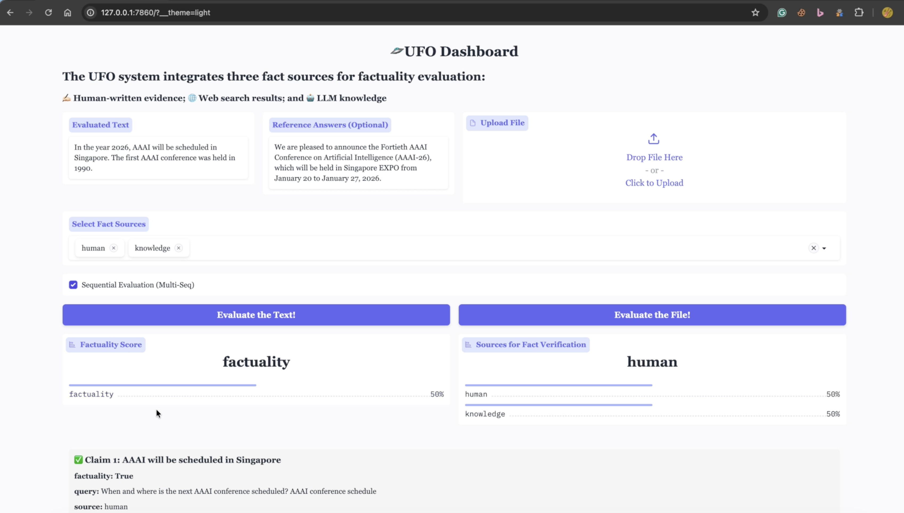
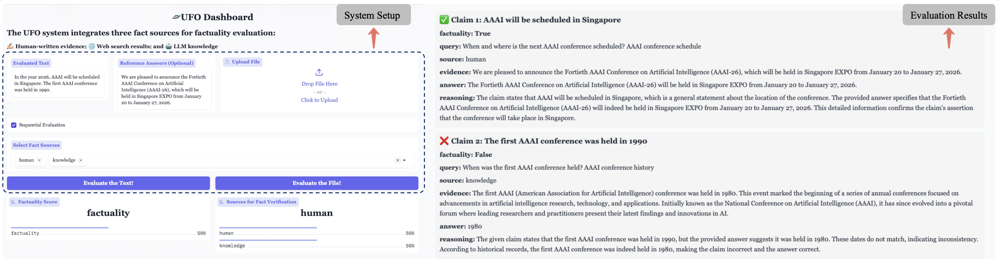

# 🛸 UFO: A Unified Framework for Factuality Evaluation with Multiple Plug-and-Play Fact Sources

*Submission to AAAI 2026 (Demo Track)*

UFO is a unified, extensible framework for evaluating the factuality of LLM outputs, supporting multiple plug-and-play fact sources, including human-written evidence, web search results, and internal LLM knowledge. Users can also freely add new customized fact sources to benchmark LLMs and fact sources.

## 💡 Key Features

- ✅ **Flexible Multi-Source Fact Integration** - UFO addresses **the limitation of relying on a fixed or fused fact source** by enabling flexible integration of multiple and modular fact sources. Each decomposed claim in the input is verified across diverse plug-and-play sources, improving factual coverage and robustness of the evaluation.

- ✅ **Modular and Configurable Design** - The UFO system supports **both single-source and multi-source evaluation scenarios** through a unified majority-voting-based verification mechanism. This design allows users to analyze and benchmark the individual and combined effectiveness of various fact sources under different settings.

- ✅ **Interactive and Programmatic Interfaces** - The UFO system can be used in two modes: 
    - (1) Interactive Web UI: Users can input or upload texts for evaluation directly through a user-friendly web interface. 
    - (2) Programmatic Interface: Users can easily adjust and add customized fact sources and integrate the UFO system into automated pipelines for batch evaluation. Additionally, the UFO system includes five benchmark datasets from diverse domains, enabling the evaluation of advanced LLMs such as GPT-4 and DeepSeek-V3.

## 📂 Project Structure
```bash
UFOSys/
├── dataset/             # Collected five datasets for evaluation
│   ├── factcheckgpt/    # Datasets w/o human annotations
│   ├── factool-qa/
│   ├── felm-wk/
│   ├── selfaware/    
│   └── wikibio-labeled/ # Datasets w/ human annotations
├── ufo/                 # UFO Source code
│   ├── __init__.py
│   ├── config/
│   ├── dataset/
│   ├── decomposer/  # Fact unit extraction
│   ├── evaluate/   # Evaluation scenarios
│   ├── extractor/  # Fact source verification
│   ├── generator/  # Generate query for each fact unit
│   ├── pipeline/   # Assemble each UFO module
│   ├── retriever/  # Fact sources setting
│   ├── utils/      
│   └── verifier/   # Fact consistency discrimination
├── requirements.txt     # Python dependencies
├── app.py      # Launch the web interface
├── config.yaml      # Basic configuration file
├── example_data_upload.jsonl # The sample JSONL file for evaluation
├── README.md            # Project description
└── LICENSE              # License file
```

## 🛠️ Quickstart
Requirements: Python 3.11+
### Clone the Repository and Install Dependencies
```shell
$ git clone git@github.com:WaldenRUC/UFOSys.git
$ cd UFOSys/
# install python dependencies
$ pip install -r requirements.txt
# configure settings such as fact sources
$ vi config.yaml
# launch the system with the interactive Web UI
$ python app.py
```

## 🖥 Screenshots





## ⚙️ Usage
The UFO system can be used in two primary ways:
- 🧑‍💻 Programmatically via Python script
- 🌐 Interactively via a web-based user interface

### 🔧 Configuration
Before running the system, update the following fields in `config.yaml`:
- `openai_apikey`
- `openai_baseurl`
- `openai_model`

You can choose between online LLM inference services and local backends as the model source:

☁️ Online Services: 
- [OpenAI](https://openai.com)
- [Siliconflow](https://www.siliconflow.cn)

🖥️ Local Backend (via vLLM): 

To serve a local model (e.g., Qwen2.5-14B-Instruct) using vllm:
```shell
CUDA_VISIBLE_DEVICES=0 nohup vllm serve <model_name> --dtype auto --api-key EMPTY --port 2233 --tensor-parallel-size 1 > qwen2.5-14b.log 2>&1 &
```


### 📚 Fact sources
UFO supports multiple plug-and-play fact sources. You can enable and configure them individually in `config.yaml`.

#### 1. 🔎 Human-written Evidence Retrieval via ElasticSearch (Optional)
To enable ElasticSearch-based retrieval, follow these steps:
1. Download [Elasticsearch-8.12.2](https://www.elastic.co/guide/en/elasticsearch/reference/8.12/targz.html) and [Wikipedia dump](https://huggingface.co/datasets/facebook/wiki_dpr)
2. Before starting the service, configure `path.data`, `http.port` and `http.host` in `config/elasticsearch.yml`
3. Start the ElasticSearch server:
```shell
cd elasticsearch-8.12.2/
nohup ./bin/elasticsearch &
```

#### 2. 🌐 Web Search Results (via Serper API)
To enable web search-based evidence retrieval, set your API key in `config.yaml`:
```yaml
serper_apikey: <your_serper_api_key>
```
You can obtain a key from [Serper.dev](https://serper.dev)

#### 3. 🤖 Internal LLM Knowledge
To use LLM knowledge as a fact source, configure the following under the `llm_knowledge` section in `config.yaml`:
```yaml
llm_knowledge:
    openai_apikey: <your_key>
    openai_baseurl: <https://api.openai.com or local endpoint>
    openai_model: <gpt-4, qwen, etc.>
```
You can point to either OpenAI, SiliconFlow, or a local vLLM backend (see earlier section).


## 🚀 Run the UFO System Programmatically
To run the UFO system in batch mode via script, first configure the following in `config.yaml`:
1. I/O settings
    - `dataset_name`: Name of the dataset being evaluated
    - `save_dir`: Directory to save evaluation results
2. Inference settings
    - `openai_apikey`
    - `openai_baseurl`
    - `openai_model`
3. Fact source settings
    - Configure your preferred fact sources in `config.yaml` (e.g., `llm_knowledge`, `elasticsearch`, or `serper`) as described in the previous section.
    - To use a custom or additional fact source, you can simply implement it as a new module under `ufo/retriever/` and register it in the configuration.

Run the evaluation script:
```bash
bash run_exp.sh
```
This generates an output `.json` file with claim-level verification results and details.
You can then use the UFO evaluation functions to compute final factuality scores. The UFO framework supports both single-source and multi-source evaluation scenarios:
```python
import numpy as np
# evaluate the output dataset
from ufo.evaluate import get_multi_source_majority, get_multi_source_seq_majority
# 1. Single Source
preds, _ = get_multi_source_seq_majority(output_dataset, ordered_source_names=['web'])
# Multi-MV
preds, _ = get_multi_source_seq_majority(output_dataset, unordered_source_names=['human', 'web', 'knowledge'])
# Multi-Seq
preds, _ = get_multi_source_seq_majority(output_dataset, ordered_source_names=['human', 'web', 'knowledge'])
# obtain UFO score
score = np.mean(preds)
```
You can flexibly choose which fact sources to include and the voting strategy that best suits your evaluation scenario.

## 🚀 Run the UFO System Interactively
To launch the interactive web interface, run:
```shell
python app.py
```
Then open your browser and go to http://localhost:7860.

You can evaluate:
- A single input text with an optional reference answer
- Or any custom `.jsonl` file where each line includes:
    - `"response" (str)`: The LLM-generated output to be evaluated
    - `"reference_answers" (List[str], optional)`: Human-written or golden references

Example:
```json
{"response": "Python was created by Guido van Rossum and released in 1991.", "reference_answers": ["Python was created by Guido van Rossum and was released in 1991. Python is a high-level, interpreted programming language known for its simplicity and readability."]}
{"response": "The Earth is the third planet from the Sun and the only astronomical object known to harbor life.", "reference_answers": ["Earth is the third planet from the Sun and the only astronomical object known to harbor life. About 29.2% of Earth's surface is land and 70.8% is water."]}
```

## 📄 License
```sql
Copyright (c) 2018 The Python Packaging Authority

Permission is hereby granted, free of charge, to any person obtaining a copy
of this software and associated documentation files (the "Software"), to deal
in the Software without restriction, including without limitation the rights
to use, copy, modify, merge, publish, distribute, sublicense, and/or sell
copies of the Software, and to permit persons to whom the Software is
furnished to do so, subject to the following conditions:

The above copyright notice and this permission notice shall be included in all
copies or substantial portions of the Software.

THE SOFTWARE IS PROVIDED "AS IS", WITHOUT WARRANTY OF ANY KIND, EXPRESS OR
IMPLIED, INCLUDING BUT NOT LIMITED TO THE WARRANTIES OF MERCHANTABILITY,
FITNESS FOR A PARTICULAR PURPOSE AND NONINFRINGEMENT. IN NO EVENT SHALL THE
AUTHORS OR COPYRIGHT HOLDERS BE LIABLE FOR ANY CLAIM, DAMAGES OR OTHER
LIABILITY, WHETHER IN AN ACTION OF CONTRACT, TORT OR OTHERWISE, ARISING FROM,
OUT OF OR IN CONNECTION WITH THE SOFTWARE OR THE USE OR OTHER DEALINGS IN THE
SOFTWARE.
```