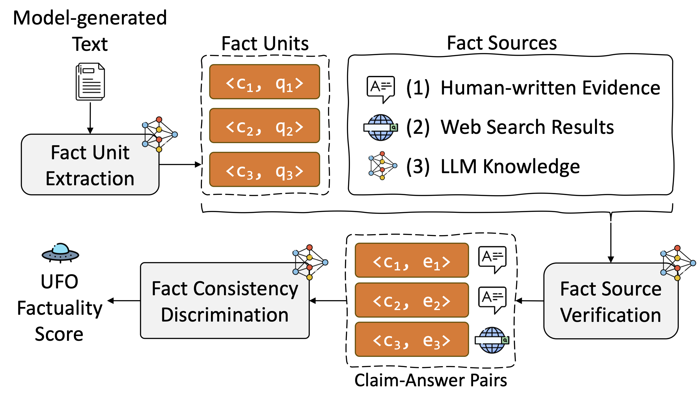
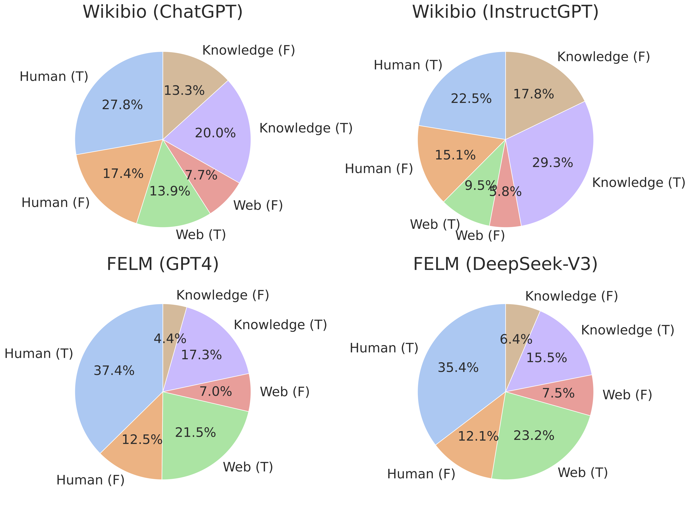

# 🛸 UFO: A Unified Framework for Factuality Evaluation with Multiple Plug-and-Play Fact Sources

*Submission to AAAI 2026 (Demo Track)*

UFO is a unified, extensible framework for evaluating the factuality of LLM outputs, supporting multiple plug-and-play fact sources, including human-written evidence, web search results, and internal LLM knowledge. Users can also freely add new customized fact sources to benchmark LLMs and fact sources.

## 📑 Table of Contents

- [💡 Key Features](#-key-features)
- [🗺️ System Overview](#-system-overview)
- [📂 Project Structure](#-project-structure)
- [🛠️ Quickstart](#️-quickstart)
- [🖥 Screenshots](#-screenshots)
- [⚙️ Usage](#️-usage)
    - [🔧 Configuration](#-configuration)
    - [📚 Fact sources](#-fact-sources)
        - [1. 🔎 Human-written Evidence Retrieval via ElasticSearch (Optional)](#1-🔎-human-written-evidence-retrieval-via-elasticsearch-optional)
        - [2. 🌐 Web Search Results (via Serper API)](#2--web-search-results-via-serper-api)
        - [3. 🤖 Internal LLM Knowledge](#3--internal-llm-knowledge)
        - [4. 🧩 Set your own fact sources](#4--set-your-own-fact-sources)
- [🚀 Run the UFO System Programmatically](#-run-the-ufo-system-programmatically)
- [🚀 Run the UFO System Interactively](#-run-the-ufo-system-interactively)
- [🔬 Experiments](#-experiments)
- [📄 License](#-license)

## 💡 Key Features

- ✅ **Flexible Multi-Source Fact Integration** - UFO addresses **the limitation of relying on a fixed or fused fact source** by enabling flexible integration of multiple and modular fact sources. Each decomposed claim in the input is verified across diverse plug-and-play sources, improving factual coverage and robustness of the evaluation.

- ✅ **Modular and Configurable Design** - The UFO system supports **both single-source and multi-source evaluation scenarios** through a unified majority-voting-based verification mechanism. This design allows users to analyze and benchmark the individual and combined effectiveness of various fact sources under different settings.

- ✅ **Interactive and Programmatic Interfaces** - The UFO system can be used in two modes: 
    - (1) Interactive Web UI: Users can input or upload texts for evaluation directly through a user-friendly web interface. 
    - (2) Programmatic Interface: Users can easily adjust and add customized fact sources and integrate the UFO system into automated pipelines for batch evaluation. Additionally, the UFO system includes five benchmark datasets from diverse domains, enabling the evaluation of advanced LLMs such as GPT-4 and DeepSeek-V3.

## 🗺️ System Overview

<p align="center">
  
  <br>
  <em>Figure 1: Overall pipeline of UFO. Claims are decomposed, verified across plug-and-play fact sources such as human evidence, web search, and LLM knowledge, then aggregated via implemented Single Source / Multi-MV / Multi-Seq scenarios.</em>
</p>

## 📂 Project Structure
```bash
UFOSys/
├── dataset/             # Collected five datasets for evaluation
│   ├── factcheckgpt/    # Datasets w/o human annotations
│   ├── factool-qa/
│   ├── felm-wk/
│   ├── selfaware/    
│   └── wikibio-labeled/ # Datasets w/ human annotations
├── ufo/                 # UFO Source code
│   ├── __init__.py
│   ├── config/
│   ├── dataset/
│   ├── decomposer/  # Fact unit extraction
│   ├── evaluate/   # Evaluation scenarios
│   ├── extractor/  # Fact source verification
│   ├── generator/  # Generate query for each fact unit
│   ├── pipeline/   # Assemble each UFO module
│   ├── retriever/  # Fact sources setting
│   ├── utils/      
│   └── verifier/   # Fact consistency discrimination
├── requirements.txt     # Python dependencies
├── app.py      # Launch the web interface
├── config.yaml      # Basic configuration file
├── example_data_upload.jsonl # The sample JSONL file for evaluation
├── README.md            # Project description
└── LICENSE              # License file
```

## 🛠️ Quickstart
Requirements: Python 3.11+
### Clone the Repository and Install Dependencies
```shell
$ git clone git@github.com:WaldenRUC/UFOSys.git
$ cd UFOSys/
# install python dependencies
$ pip install -r requirements.txt
# configure settings such as fact sources
$ vi config.yaml
# launch the system with the interactive Web UI
$ python app.py
# alternatively, run batch evaluation with the Python interface
$ bash run_exp.sh
```

## 🖥 Screenshots

<p align="center">
  <br>
  <em>The UFO web interface.</em>
</p>

<p align="center">
  <br>
  <em>The interface contains two parts: System Setup and Evaluation Results.</em>
</p>

## ⚙️ Usage
The UFO system can be used in two primary ways:
- 🧑‍💻 Programmatically via Python script
- 🌐 Interactively via a web-based user interface

### 🔧 Configuration
Before running the system, update the following fields in `config.yaml`:
- `openai_apikey`
- `openai_baseurl`
- `openai_model`
- `retriever`

You can choose between **online LLM inference services** and **local backends** as the model source:

☁️ Online Services: 
- [OpenAI](https://openai.com)
- [Siliconflow](https://www.siliconflow.cn)

🖥️ Local Backend (via vLLM): 

To serve a local model (e.g., Qwen2.5-14B-Instruct) using vllm:
```shell
CUDA_VISIBLE_DEVICES=0 nohup vllm serve <model_name> --dtype auto --api-key EMPTY --port 2233 --tensor-parallel-size 1 > qwen2.5-14b.log 2>&1 &
```

### 📚 Fact sources
UFO supports multiple plug-and-play fact sources. You can enable and configure them individually in `config.yaml`. You can also add your own customized fact sources with a few simple steps.

#### 1. 🔎 Human-written Evidence Retrieval via ElasticSearch (Optional)
To enable ElasticSearch-based retrieval, follow these steps:
1. Download [Elasticsearch-8.12.2](https://www.elastic.co/guide/en/elasticsearch/reference/8.12/targz.html) and [Wikipedia dump](https://huggingface.co/datasets/facebook/wiki_dpr)
2. Before starting the service, configure `path.data`, `http.port` and `http.host` in `config/elasticsearch.yml`
3. Start the ElasticSearch server:
```shell
cd elasticsearch-8.12.2/
nohup ./bin/elasticsearch &
```

#### 2. 🌐 Web Search Results (via Serper API)
To enable web search-based evidence retrieval, set your API key in `config.yaml`:
```yaml
serper_apikey: <your_serper_api_key>
```
You can obtain a key from [Serper.dev](https://serper.dev)

#### 3. 🤖 Internal LLM Knowledge
To use LLM knowledge as a fact source, configure the following under the `llm_knowledge` section in `config.yaml`:
```yaml
llm_knowledge:
    openai_apikey: <your_key>
    openai_baseurl: <https://api.openai.com or local endpoint>
    openai_model: <gpt-4, qwen, etc.>
```
You can point to either OpenAI, SiliconFlow, or a local vLLM backend (see earlier section).

#### 4. 🧩 Set your own fact sources
You can add customized fact sources for in-domain evaluation tasks. Once added, they will be available in both the web UI and the Python interface.

- Configure the new fact source in the `retriever` section of `config.yaml` file.
- Implement your fact source in `ufo/retriever/template_retriever.py` file, referring to the existing UFO implementations as examples.
- Register your fact source in `ufo/retriever/__init__.py` and `ufo/utils/utils.py`
- ⭐️ Done! Your fact source is now ready to benchmark both LLMs and fact sources.

## 🚀 Run the UFO System Programmatically
To run the UFO system in batch mode via script, first configure the following in `config.yaml`:
1. I/O settings
    - `dataset_name`: Name of the dataset being evaluated
    - `save_dir`: Directory to save evaluation results
2. Inference settings
    - `openai_apikey`
    - `openai_baseurl`
    - `openai_model`
3. Fact source settings
    - Specify your preferred fact sources in `config.yaml` (e.g., `llm_knowledge`, `elasticsearch`, or `serper`) as described in the previous section.
    - To use a custom or additional fact source, you can simply implement it as a new module under `ufo/retriever/` and register it in the configuration. See [🧩 Set your own fact sources](#4--set-your-own-fact-sources) for details.

---

### Step 1: Run the Evaluation Script
```bash
bash run_exp.sh
```
This will generate an output .json file (e.g., result.json) containing **claim-level verification results and details**. The file can then be used to benchmark LLM outputs and fact sources.

### Step 2: Benchmark LLMs with UFO Evaluation Scenarios
You can compute factuality scores with the built-in evaluation scenarios:
- Single Source: evaluate against one fact source
- Multi-MV: majority vote across multiple sources (unordered)
- Multi-Seq: sequential majority vote across ordered sources
You can also customize new scenarios in the `ufo/evaluate` directory.

```python
import numpy as np
# --- load output dataset ---
import json
with open('result.json', 'r', encoding='utf-8') as fp:
    output_dataset = json.load(fp)
# --- evaluate the output dataset ---
from ufo.evaluate import get_multi_source_majority, get_multi_source_seq_majority
# 1. Single Source (web only)
preds, _ = get_multi_source_seq_majority(output_dataset, ordered_source_names=['web'])
# 2. Multi-MV
preds, _ = get_multi_source_majority(output_dataset, unordered_source_names=['human', 'web', 'knowledge'])
# 3. Multi-Seq
preds, _ = get_multi_source_seq_majority(output_dataset, ordered_source_names=['human', 'web', 'knowledge'])
# --- obtain UFO score ---
score = np.mean(preds)
```
You can freely select which fact sources to include and which voting strategy best fits your evaluation scenario.

### Step 3: Benchmark Fact Sources
To analyze the **relative contributions of fact sources**, run:
```bash
python draw_pie.py \
    --input_fn result.json \
    --dataset Wikibio \
    --source ChatGPT \
    --scenario human web knowledge
```
This command will output a **pie chart** showing the ratio of different fact sources used in the evaluation on the **Wikibio** dataset generated by **ChatGPT**.


## 🚀 Run the UFO System Interactively
To launch the interactive web interface, run:
```shell
python app.py
```
Then open your browser and go to http://localhost:7860.

You can evaluate:
- A single input text with an optional reference answer,
- Or any custom `.jsonl` file where each line includes:
    - `"response" (str)`: The LLM-generated output to be evaluated,
    - `"reference_answers" (List[str], optional)`: Human-written or golden references

Example:
```json
{"response": "Python was created by Guido van Rossum and released in 1991.", "reference_answers": ["Python was created by Guido van Rossum and was released in 1991. Python is a high-level, interpreted programming language known for its simplicity and readability."]}
{"response": "The Earth is the third planet from the Sun and the only astronomical object known to harbor life.", "reference_answers": ["Earth is the third planet from the Sun and the only astronomical object known to harbor life. About 29.2% of Earth's surface is land and 70.8% is water."]}
```
The outputs include:
- The evaluation score,
- The ratio of fact sources in claim-level verification, and
- The detailed verification process

For a full demonstration, please refer to our submitted video.


## 🔬 Experiments

### 📊 Dataset Statistics

We collect multiple datasets for evaluation, which can be found in the `dataset/` directory.

| Dataset          | Generator   | Average Tokens | Domain                               | Size |
|------------------|-------------|----------------|--------------------------------------|------|
| Wikibio          | ChatGPT     | 183.72         | Biography                            | 183  |
| Wikibio          | InstructGPT | 148.11         | Biography                            | 183  |
| Wikibio          | PerplexityAI| 245.56         | Biography                            | 183  |
| FELM-wk          | GPT4        | 81.01          | History, geography, biology, sports  | 184  |
| FELM-wk          | DeepSeek-V3 | 266.92         | History, geography, biology, sports  | 184  |
| Factool-QA       | GPT4        | 51.94          | History, geography, biology, science | 50   |
| Factool-QA       | DeepSeek-V3 | 243.30         | History, geography, biology, science | 50   |
| FactCheckGPT-QA  | GPT4        | 149.37         | History, technology, science, sports | 94   |
| FactCheckGPT-QA  | DeepSeek-V3 | 354.06         | History, technology, science, sports | 94   |
| Selfaware        | GPT4        | 76.97          | History, biology, philosophy, psychology | 200 |
| Selfaware        | DeepSeek-V3 | 267.86         | History, biology, philosophy, psychology | 200 |

*Table 1: Statistics of collected datasets with various evaluated LLM generators.*


On the Wikibio human-annotated dataset, we evaluate our system under the scenario combining human, web, and LLM knowledge as fact sources. We further compare against baselines that rely on a single source (human, web, or LLM knowledge) or a fused source with majority voting. Experimental results demonstrate that the proposed Multi-Seq mode achieves the highest consistency with human annotations.

| Evaluated LLM | ChatGPT (r) | ChatGPT (ρ) | ChatGPT (τ) | InstructGPT (r) | InstructGPT (ρ) | InstructGPT (τ) | PerplexityAI (r) | PerplexityAI (ρ) | PerplexityAI (τ) |
|---------------|--------------|--------------|--------------|-----------------|-----------------|-----------------|------------------|------------------|------------------|
| Human         |  <u>0.566†</u> | <u>0.517†</u> | <u>0.367†</u> | <u>0.428†</u> | <u>0.407†</u>          | 0.313†          | 0.245†           | 0.281†           | 0.239†           |
| Web           | 0.546†       | 0.470†       | 0.340†       | 0.390†   | 0.360†   | 0.269†          | 0.250†           | <u>0.286†</u>    | 0.233†           |
| Knowledge    | 0.441†       | 0.406†       | 0.286†       | 0.322†          | 0.302†          | 0.316†  | <u>0.258†</u>    | 0.263†           | 0.245†    |
| Multi-MV    | 0.448†       | 0.403†       | 0.299†       | 0.420†   | 0.391†          | <u>0.326†</u>   | 0.235†           | 0.243†           | <u>0.258†</u>           |
| Multi-Seq    | **0.625†**   | **0.590†**   | **0.496†**   | **0.520†**      | **0.489†**      | **0.468†**      | **0.445†**       | **0.458†**       | **0.439†**       |

*Table 2: Experimental results on Wikibio. A higher correlation coefficient (measured by Pearson’s r, Spearman’s ρ, and Kendall’s τ) demonstrates better evaluation consistency with human evaluation. The “Multi-Seq” evaluation denotes sequential evaluation (human-written evidence, web search results, and LLM knowledge). † indicates p-value < 0.05. The best result is **bold**, and the second best result is <u>underlined</u>.*

The experimental results of **benchmarking LLMs and fact sources** can be found in Table 3 and Figure 2.

| Model            | GPT4  | DeepSeek-V3 |
|------------------|-------|-------------|
| FELM-wk          | 0.725 | **0.732**   |
| Factool-QA       | 0.647 | **0.686**   |
| FactCheckGPT-QA  | 0.707 | **0.753**   |
| Selfaware        | 0.796 | **0.824**   |

*Table 3: Factuality evaluation of GPT4 and DeepSeek on four datasets, with the Multi-Seq evaluation scenario.*


<p align="center">
  <br>
  <em>Figure 2: The ratio of decomposed claims verified by different fact sources on Wikibio and FELM-wk dataset.</em>
</p>


## 📄 License
This project is released under the MIT License. See [LICENSE](LICENSE) for details.